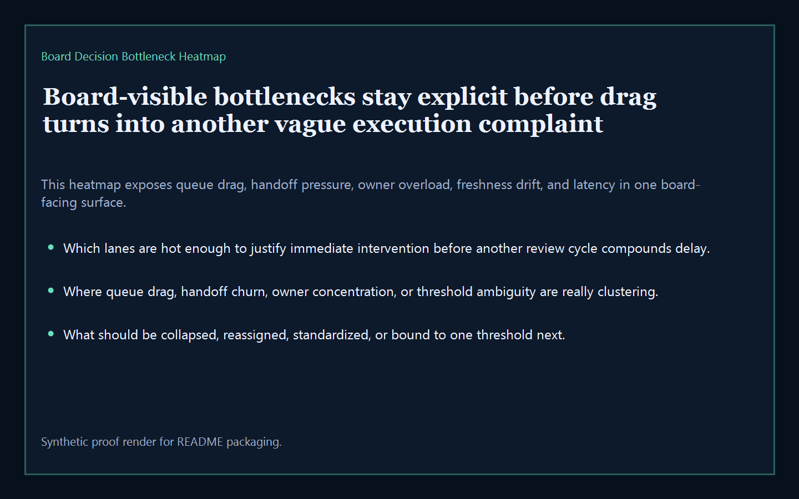
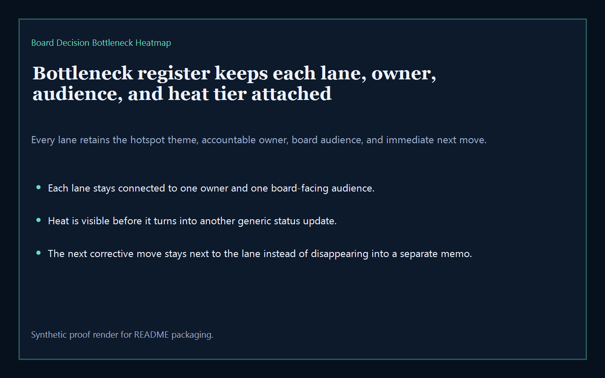
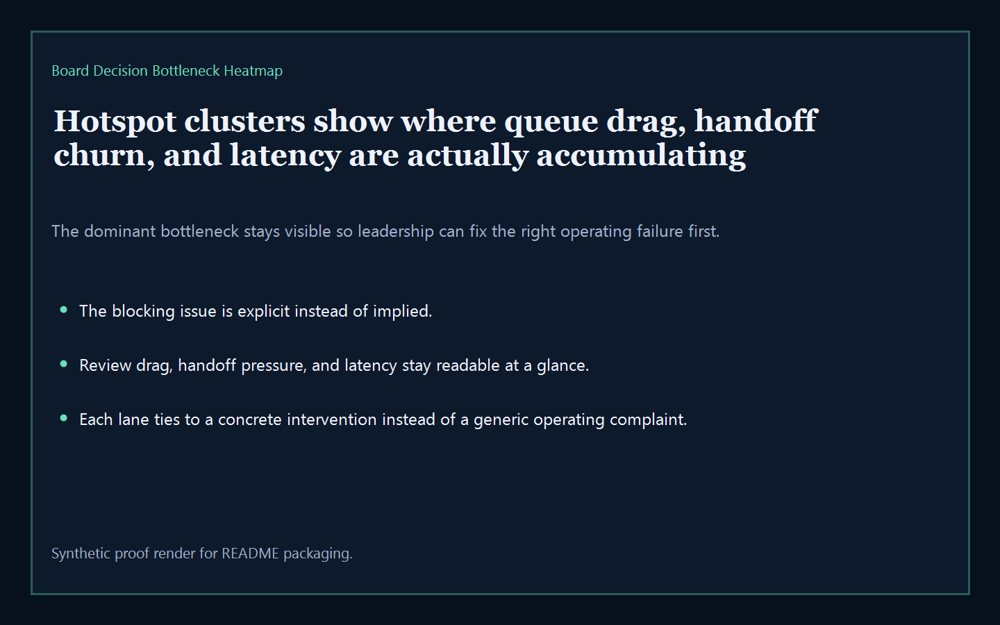
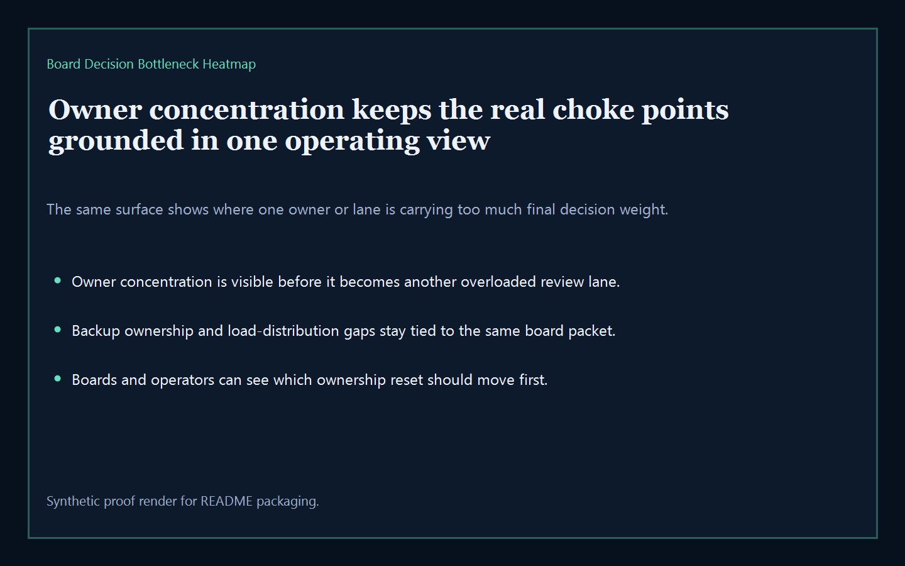

# Board Decision Bottleneck Heatmap

Board-ready executive-intelligence surface for exposing board-decision bottlenecks, review drag clusters, owner concentration, and threshold conflicts across the broader Kinetic Gain suite.

- Live: `http://bottlenecks.kineticgain.com/`
- Repo: `mizcausevic-dev/board-decision-bottleneck-heatmap`

## Why this matters

Leaders need one board-readable hotspot surface that shows where review queues, handoff chains, overloaded owners, and threshold ambiguity are actually clustering before another board cycle turns local friction into systemic delay.

## What it includes

- TypeScript executive-intelligence surface for tracking review drag, handoff pressure, owner concentration, evidence freshness, decision latency, and hotspot intensity
- synthetic lanes across multiple sectors, owner groups, and board-visible bottleneck risks
- reusable outputs for bottleneck register, hotspot clusters, owner concentration, drag pressure, and board-ready next-move prompts
- prerendered static site, JSON payloads, screenshots, and docs

## Routes

- `/`
- `/bottleneck-register`
- `/hotspot-clusters`
- `/owner-concentration`
- `/verification`
- `/docs`

## Local run

```bash
cd board-decision-bottleneck-heatmap
npm install
npm run verify
npm run prerender
npm run render:assets
```

## CLI

```bash
npx board-decision-bottleneck-heatmap fixtures/board-decision-bottleneck-heatmap.json --format summary
npx board-decision-bottleneck-heatmap fixtures/board-decision-bottleneck-heatmap-clean.json --format json
```

## Docs

- [Architecture](docs/architecture.md)
- [Origin](docs/ORIGIN.md)
- [Kinetic Gain Embedded](docs/KINETIC_GAIN_EMBEDDED.md)

## Screenshots





